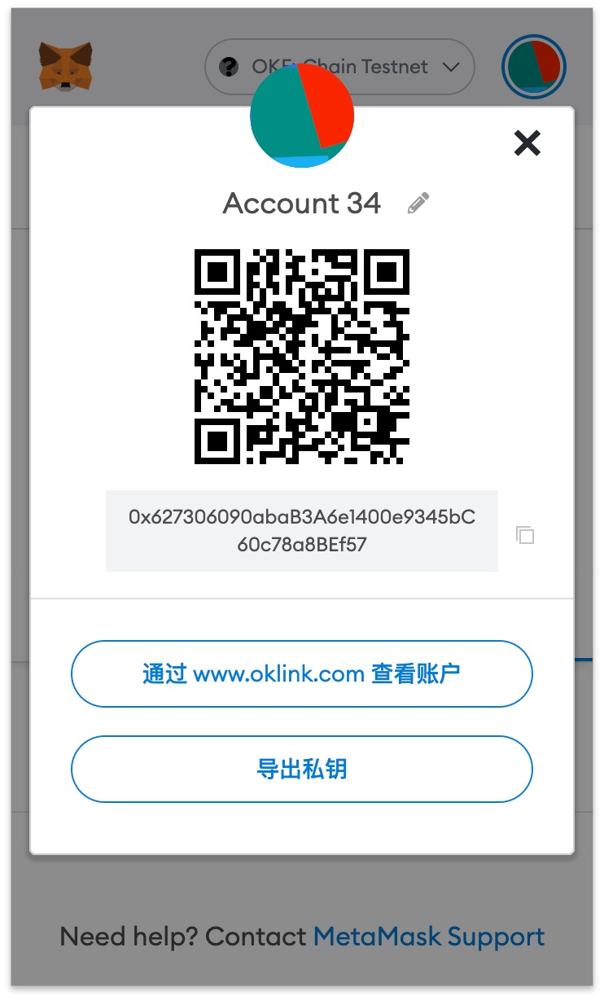
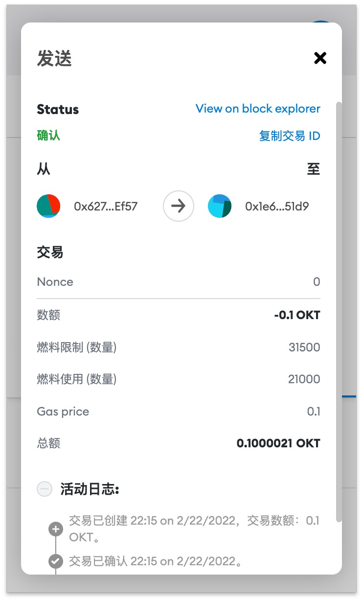
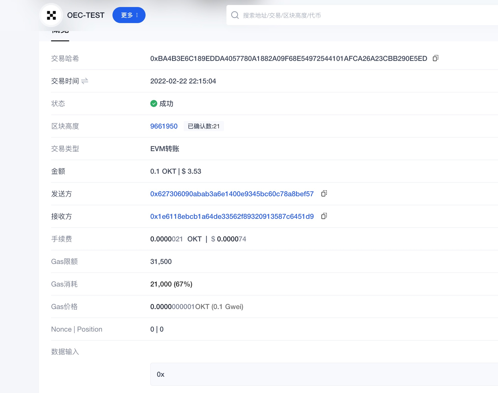
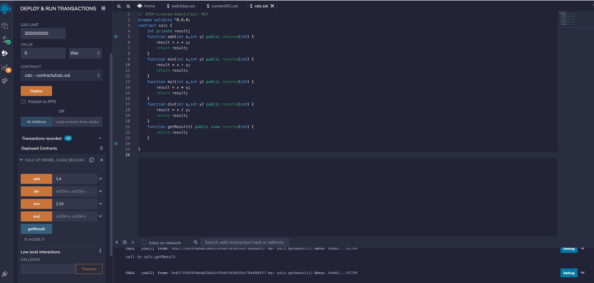
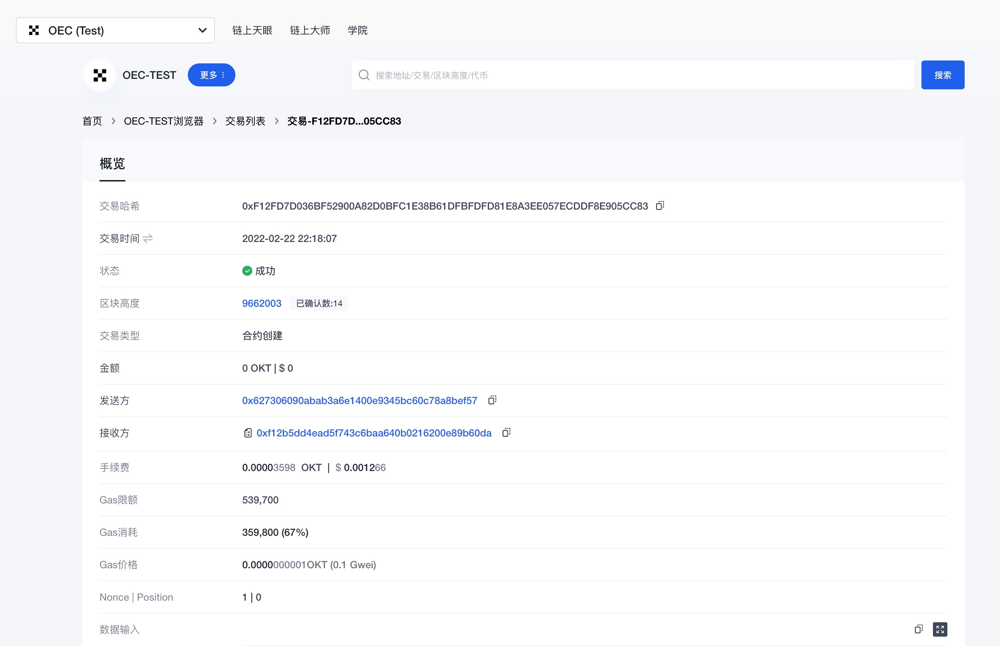
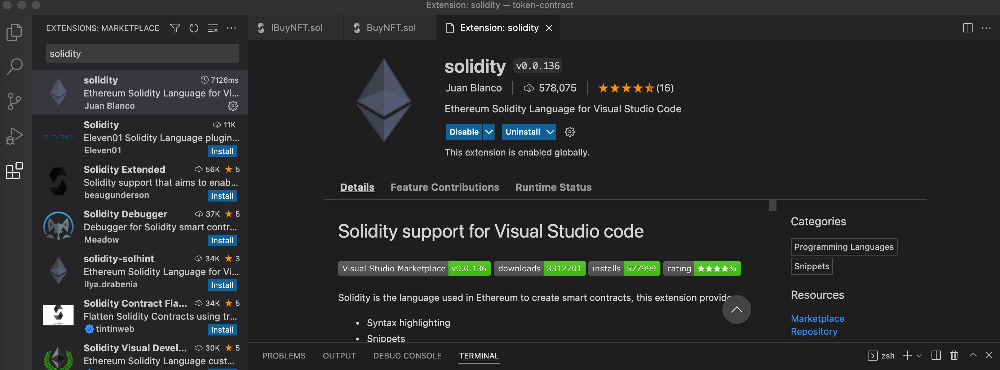

### W1-1作业： 
### 作业要求：
1. 使用自己的 github 创建一个作业代码库
2. 每一次作业使用一个文件夹(w1)
3. 提交代码、截图、交易 hash 等
### 作业内容
### Q1：安装 Metamask、并创建好账号

### A1：

 

### Q2：执行一次转账
### A2：
  
  

### Q3:使用 Remix 创建任意一个合约
### A3：
  
  

### Q4: VSCode IDE 开发环境配置
### A4:
  

### Q5: 使用 Truffle 部署 Counter 合约 到 test 网络（goerli）（提交交易 hash）
### A5:

### Q6:编写一个测试用例
### A6:

