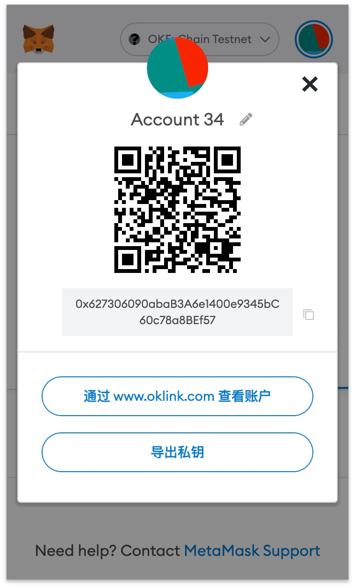
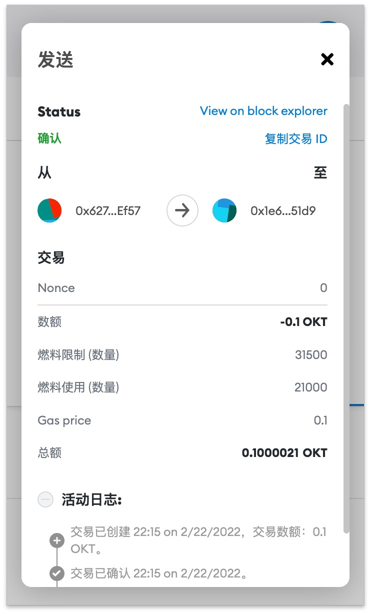
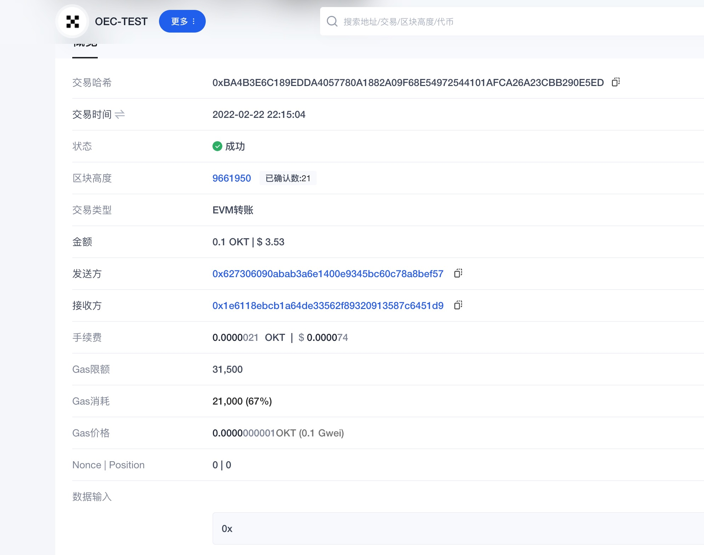
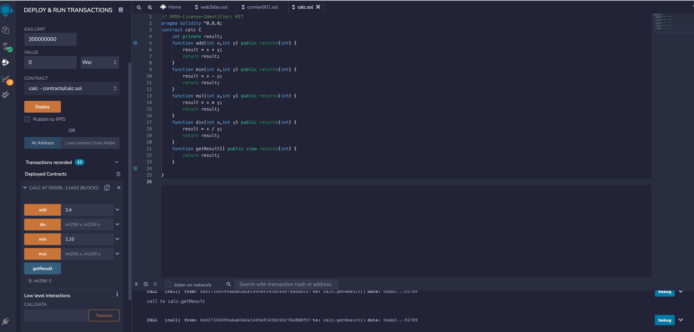
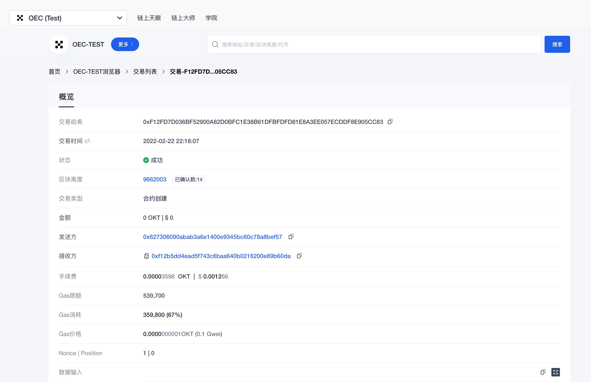
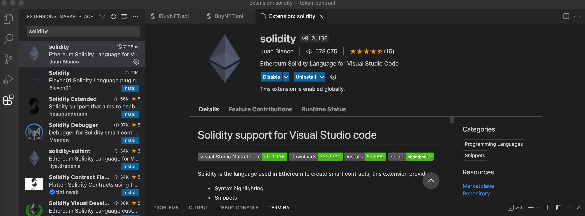
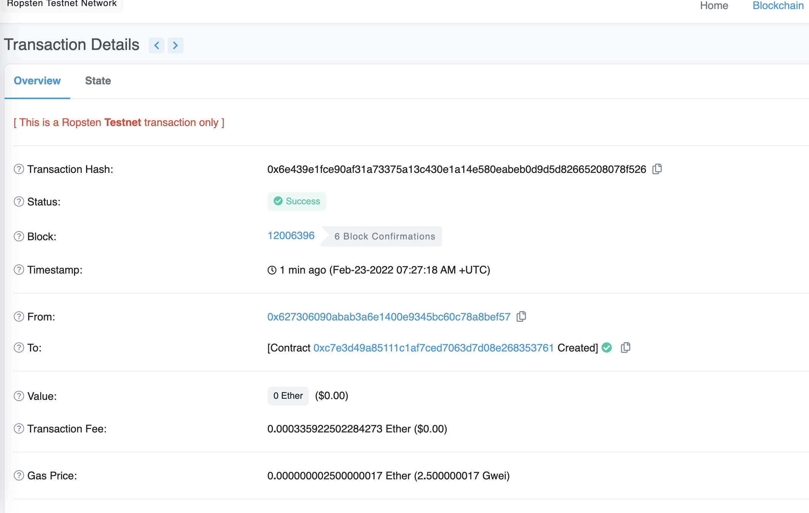
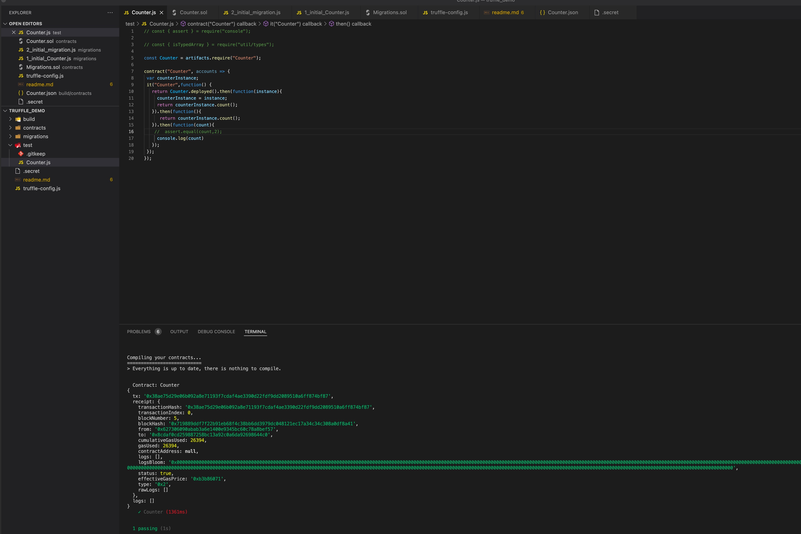

### W1-1作业： 
本次作业说明：
- homework为本次作业提交内容
- 全部代码在truffle_demo目录
- pic目录为截图目录

### 作业要求：
* 安装 Metamask、并创建好账号
* 执行一次转账
* 使用 Remix 创建任意一个合约
* VSCode IDE 开发环境配置
* 使用 Truffle 部署 Counter 合约 到 test 网络（goerli）（提交交易 hash）
* 编写一个测试用例

### 作业内容
### Q1：安装 Metamask、并创建好账号

### A1：

 

### Q2：执行一次转账
### A2：
  [转账详情信息](https://www.oklink.com/zh-cn/oec-test/tx/0xba4b3e6c189edda4057780a1882a09f68e54972544101afca26a23cbb290e5ed)
  
  

  

### Q3:使用 Remix 创建任意一个合约
### A3：
  [合约详情信息](https://www.oklink.com/zh-cn/oec-test/tx/F12FD7D036BF52900A82D0BFC1E38B61DFBFDFD81E8A3EE057ECDDF8E905CC83)
  
  

### Q4: VSCode IDE 开发环境配置
### A4:
  

### Q5: 使用 Truffle 部署 Counter 合约 到 test 网络（goerli）（提交交易 hash）
### A5:
  [转账详情信息](https://ropsten.etherscan.io/tx/0x6e439e1fce90af31a73375a13c430e1a14e580eabeb0d9d5d82665208078f526)

  

### Q6:编写一个测试用例
### A6: 
- 详情代码可见工程目录下的 ./truffle_demo/test/Counter.js

