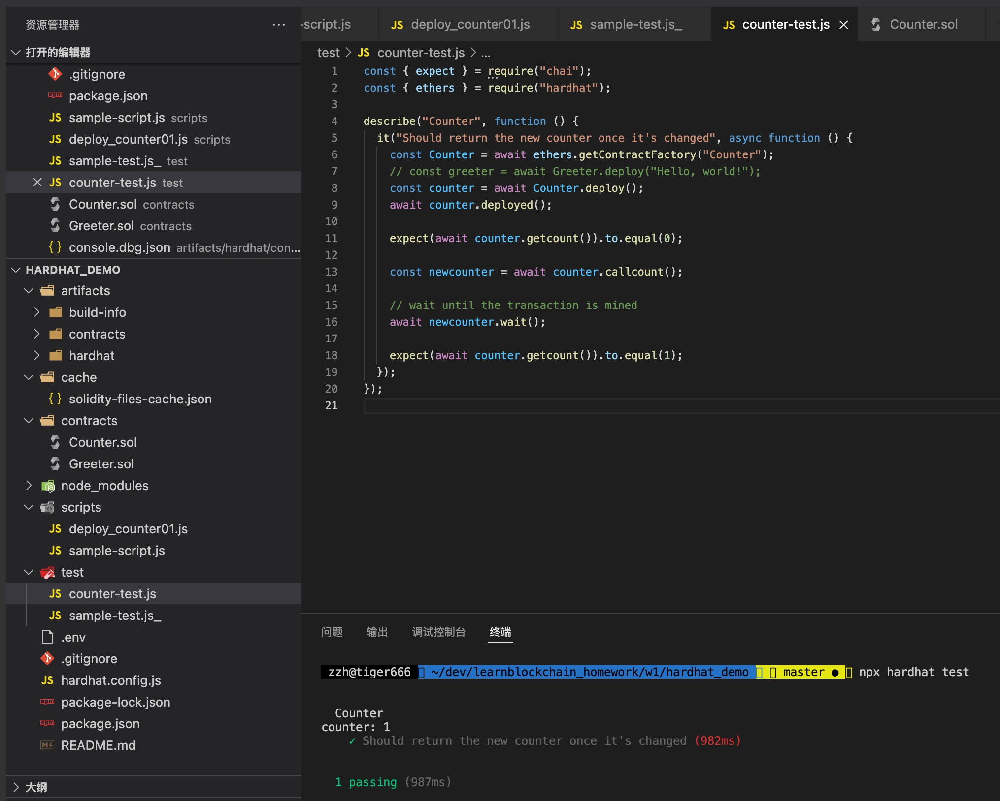
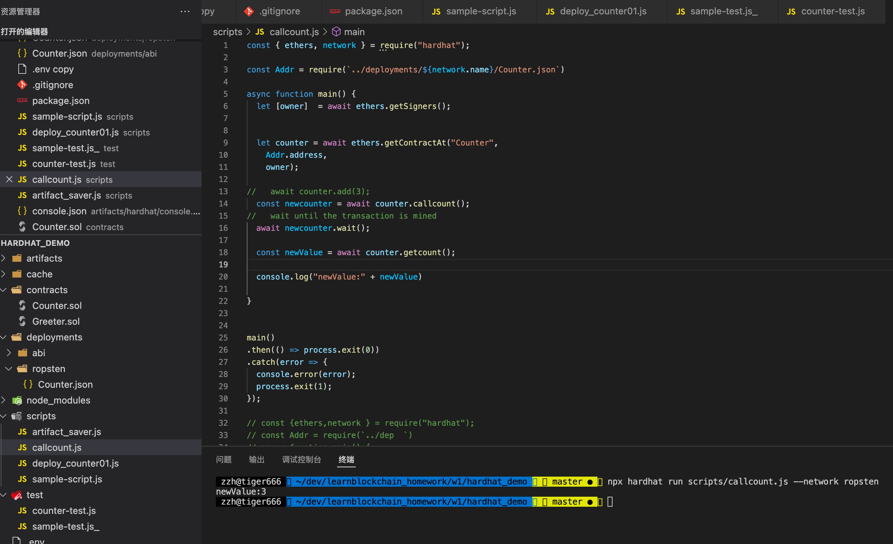

### W1-2作业： 
本次作业说明：
- w1-2为本次作业提交内容
- 全部代码在hardhat_demo目录
- pic目录为截图目录

### 作业要求：
* 使用Hardhat部署修改后的Counter
* 使用Hardhat测试Counter
* 写一个脚本调用count()

### 作业内容
### Q1：使用Hardhat部署修改后的Counter

### A1：
[Hardhat部署Counter链上数据](https://ropsten.etherscan.io/tx/0x6f4c27b942639d7b1bc11ed0bd4eed8b8ffeb1c1c84e9829cf2673bef96dccbd)

### Q2：使用Hardhat测试Counter
### A2：
  测试代码见 hardhat_demo/test/counter-test.js
  

### Q3:写一个脚本调用count()
### A3：
  调用count代码见 hardhat_demo/scripts/callcount.js  
  [count链上调用数据](https://ropsten.etherscan.io/address/0xe58f1752c0a9d94c0729ca27a974e66d8f997757)
  
  

