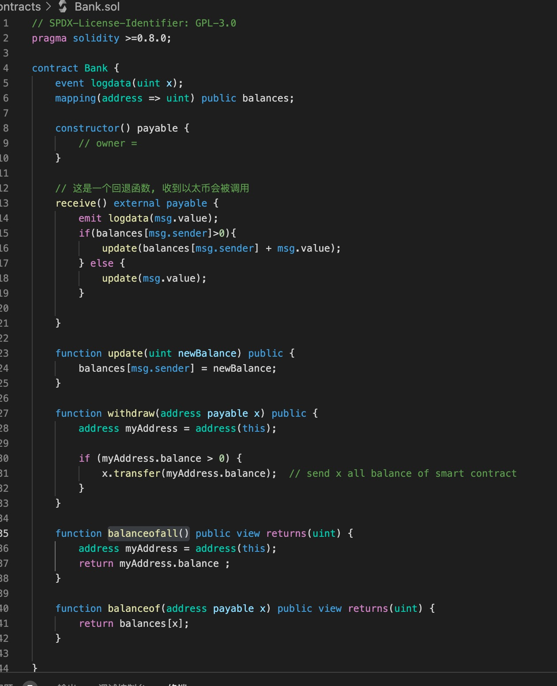
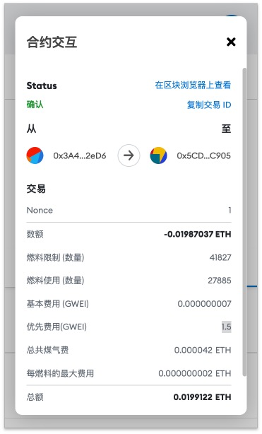
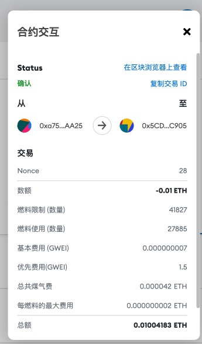
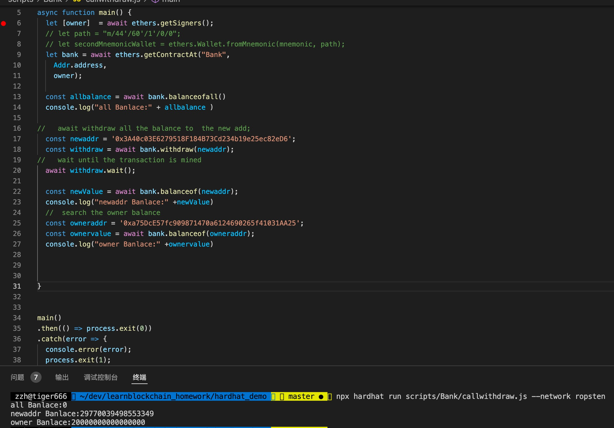

### W2-1作业：
本次作业说明：
- w2-1为本次作业提交内容
- 全部代码在hardhat_demo目录
- pic目录为截图目录

### 作业要求：
* 编写⼀个Bank合约：
* 通过 Metamask 向Bank合约转账ETH
* 在Bank合约记录每个地址转账⾦额
* 编写 Bank合约withdraw(), 实现提取出所有的 ETH

### 作业内容
- [Bank合约地址](https://ropsten.etherscan.io/address/0x2DB5110801a01DAbF843CC47Af0f7fa472b0724f)

### Q1：编写⼀个Bank合约

### A1： 
  Bank合约源码,见hardhat_demo/contracts/Bank.sol

  

### Q2：通过 Metamask 向Bank合约转账ETH

### A2：
- 0x3a40c03e6279518f184b73cd234b19e25ec82ed6通过Metamask 向Bank合约转账0.009899667999331ETH
  
- 
- 0xa75DcE57fc909871470a6124690265f41031AA25通过Metamask 向Bank合约转账0.01ETH
  

### Q3：在Bank合约记录每个地址转账⾦额

### A3：

### Q4：编写 Bank合约withdraw(), 实现提取出所有的 ETH

### A4：
- Bank合约withdraw()合约源码,见hardhat_demo/contracts/Bank.sol
- 调用withdraw()的示例见:hardhat_demo/scripts/Bank/callwithdraw.js

