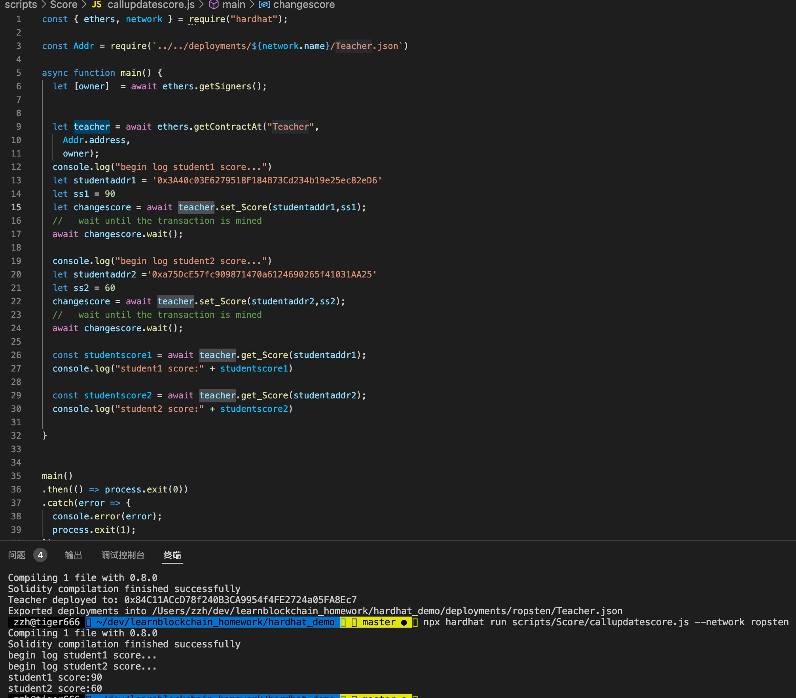

### W2-2作业：
本次作业说明：
- w2-2为本次作业提交内容
- 全部代码在hardhat_demo目录
- pic目录为截图目录

### 作业要求：
* 编写合约Score，⽤于记录学⽣（地址）分数：
    * 仅有⽼师（⽤modifier权限控制）可以添加和修改学⽣分数
    * 分数不可以⼤于 100；
* 编写合约 Teacher 作为⽼师，通过 IScore 接⼝调⽤修改学⽣分数。

### 作业内容
- [Score合约地址](https://ropsten.etherscan.io/address/0xe5599C7782034C97d72A0f2B56b5A968F12e26aA)

### Q1：编写合约Score，⽤于记录学⽣（地址）分数
  - 仅有⽼师（⽤modifier权限控制）可以添加和修改学⽣分数
  - 分数不可以⼤于 100；
### A1：
  - Score合约源码,见hardhat_demo/contracts/Score.sol

### Q2：编写合约 Teacher 作为⽼师，通过 IScore 接⼝调⽤修改学⽣分数。
### A2：
- Teacher合约:见hardhat_demo/contracts/Score.sol
- 调用调⽤修改学⽣分数updateScore()的示例见:hardhat_demo/scripts/Score/callupdatescore.js
