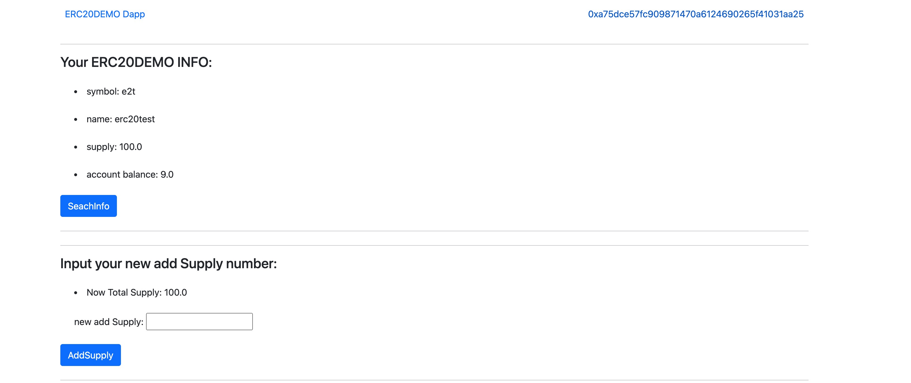
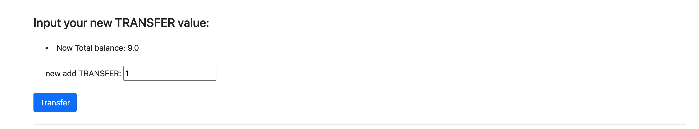
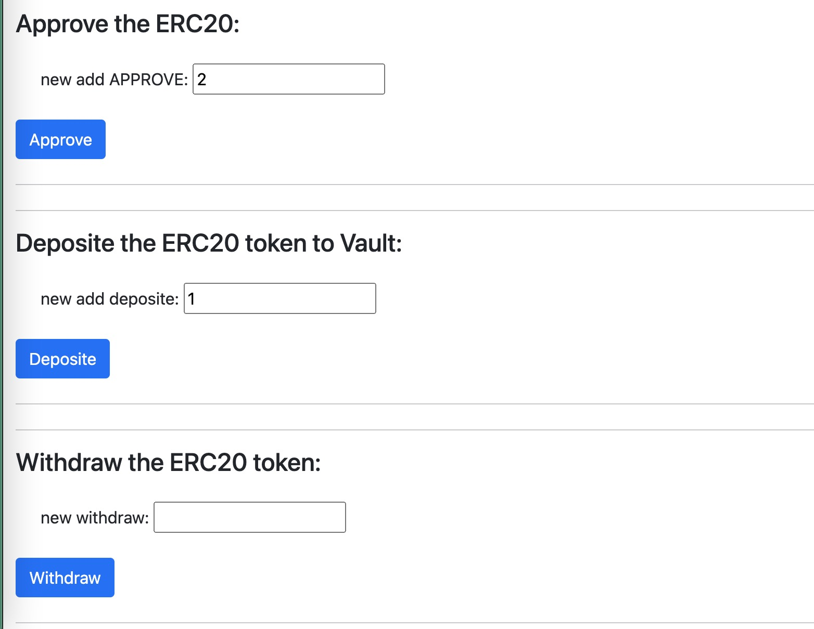

### W3-1作业：
本次作业说明：
- w3-1为本次作业提交内容
- 全部代码在hardhat_demo目录
- pic目录为截图目录

### 作业要求：
* 发⾏⼀个 ERC20 Token：
    * 可动态增发（起始发⾏量是 0）
    * 通过 ethers.js. 调⽤合约进⾏转账
* 编写⼀个Vault 合约：
    * 编写deposite ⽅法，实现 ERC20 存⼊ Vault，并记录每个⽤户存款⾦额 ， ⽤从前端调⽤（Approve，transferFrom）
    * 编写 withdraw ⽅法，提取⽤户⾃⼰的存款 （前端调⽤）
    * 前端显示⽤户存款⾦额

### 作业内容
- [ERC20_TOKEN_DEMO](https://rinkeby.etherscan.io/address/0x6577a6daee698de2cbe1ab9b3d45201245078a54)
- [Vault](https://rinkeby.etherscan.io/address/0x39D16eCC25cD70833579bB94e3371f8c88aF2329)

### Q1：发⾏⼀个 ERC20 Token：
- 可动态增发（起始发⾏量是 0）
- 通过 ethers.js. 调⽤合约进⾏转账
### A1：
- ERC20Token合约源码,见hardhat_demo/contracts/ERC20/Erc20TokenDemo.sol

### Q2： 编写⼀个Vault 合约：
  * 编写deposite ⽅法，实现 ERC20 存⼊ Vault，并记录每个⽤户存款⾦额 ， ⽤从前端调⽤（Approve，transferFrom）
  * 编写 withdraw ⽅法，提取⽤户⾃⼰的存款 （前端调⽤）
  * 前端显示⽤户存款⾦额
### A2：
- Vault合约源码,见hardhat_demo/contracts/ERC20/Vault.sol

