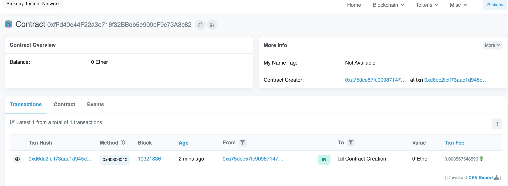

### W3-2作业：
本次作业说明：
- w3-2为本次作业提交内容
- 全部代码在hardhat_demo目录
- pic目录为截图目录

### 作业要求：
* 发行一个 ERC721 Token
  * 使用 ether.js 解析 ERC721 转账事件(加分项：记录到数据库中，可方便查询用户持有的所有NFT)
  * (或)使用 TheGraph 解析 ERC721 转账事件

### 作业内容
- [ERC721_TOKEN_DEMO](https://rinkeby.etherscan.io/address/0xfFd40e44F22a3e716f32BBdb5e909cF9c73A3c82)
- TOKEN已经完成，前端未完成
### Q1：发行一个 ERC721 Token
* 使用 ether.js 解析 ERC721 转账事件(加分项：记录到数据库中，可方便查询用户持有的所有NFT)
* (或)使用 TheGraph 解析 ERC721 转账事件
### A1：

