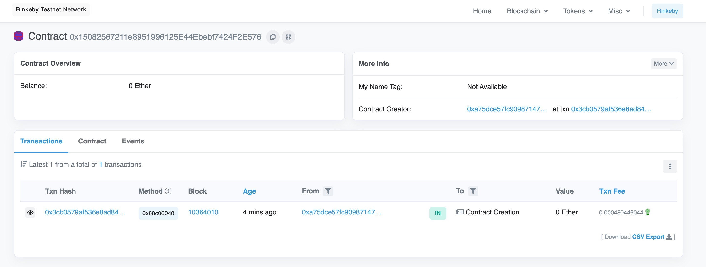
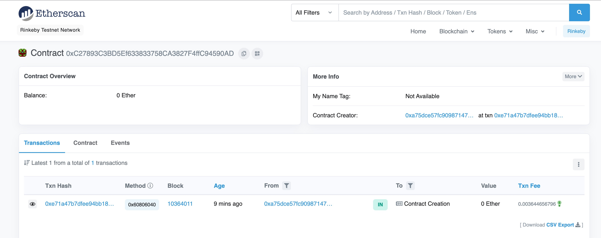
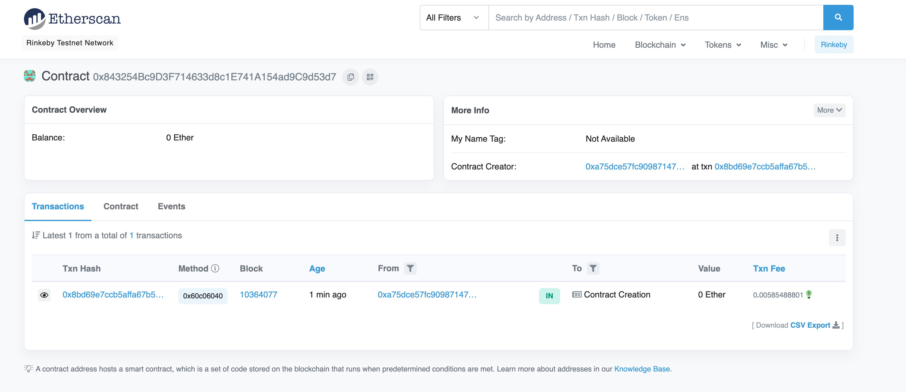
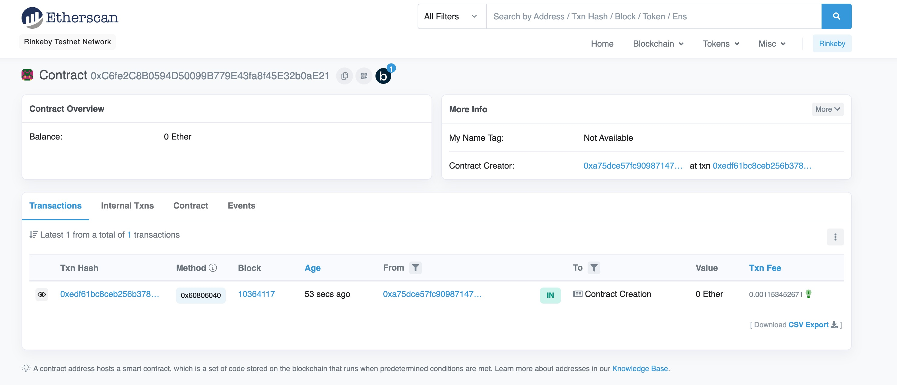
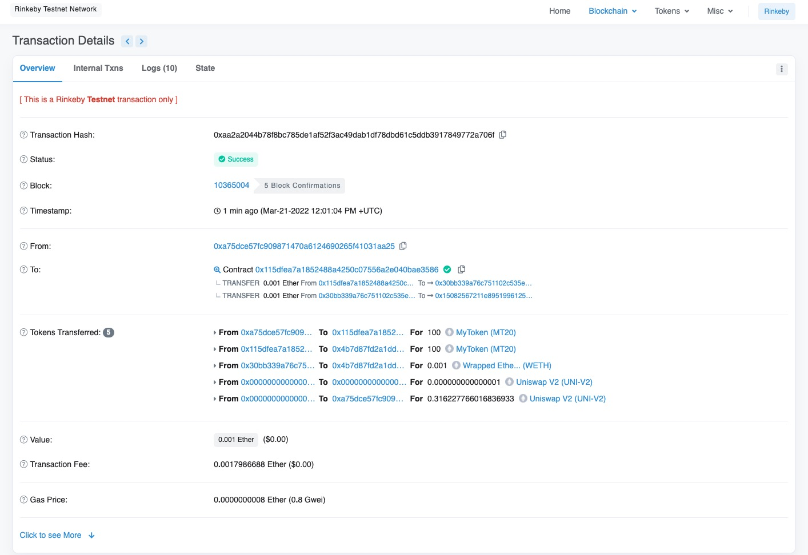
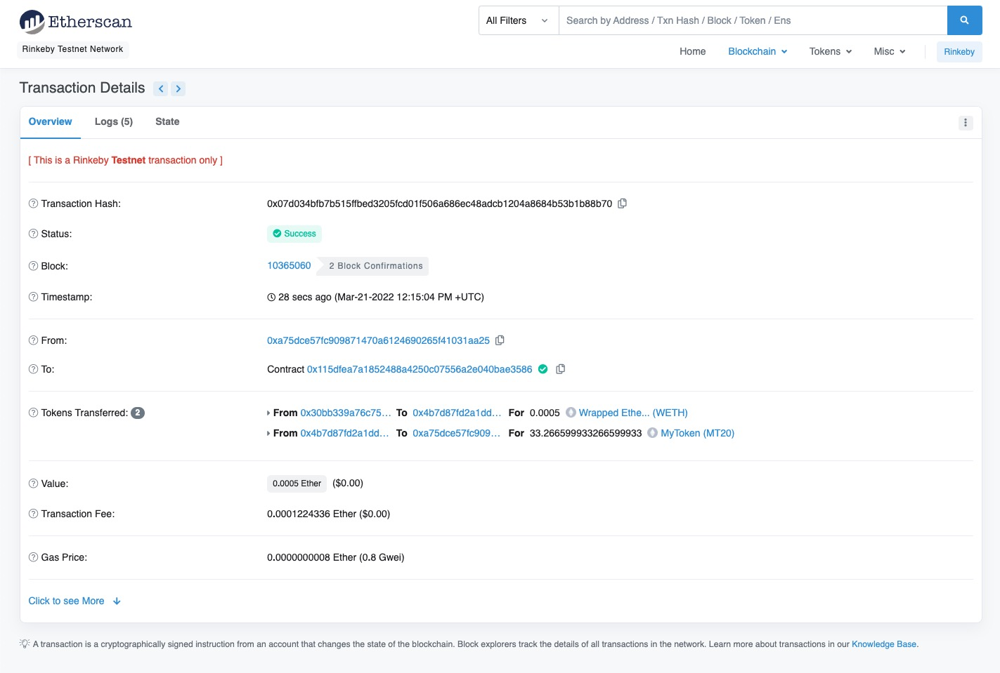

### W4-1作业：
本次作业说明：
- w4-1为本次作业提交内容
- 合约代码在hardhat_demo目录
- pic目录为截图目录

### 作业要求：
* 部署自己的 ERC20 合约 MyToken
* 编写合约 MyTokenMarket 实现：
  * AddLiquidity():函数内部调用 UniswapV2Router 添加 MyToken 与 ETH 的流动性
  * buyToken()：用户可调用该函数实现购买 MyToken

### 作业内容：

### 步骤1：部署WETH合约
- [WETH合约地址](https://rinkeby.etherscan.io/address/0x15082567211e8951996125E44Ebebf7424F2E576)

- WETH合约源码,见hardhat_demo/contracts/Myuniswap/WETH01.sol

### 步骤2：部署UniswapV2Factory
-[UniswapV2Factory合约地址](https://rinkeby.etherscan.io/address/0xC27893C3BD5Ef633833758CA3827F4ffC94590AD)

- UniswapV2Factory合约源码,见hardhat_demo/contracts/Myuniswap/UniswapV2Factory.sol

### 步骤3：部署UniswapV2Router02
-[UniswapV2Router02合约地址](https://rinkeby.etherscan.io/address/0x843254Bc9D3F714633d8c1E741A154ad9C9d53d7)

- UniswapV2Router02合约源码,见hardhat_demo/contracts/Myuniswap/UniswapV2Router02.sol

### 步骤4：部署MyToken
-[MyToken合约地址](https://rinkeby.etherscan.io/address/0x9cBf53811f76a35700f4646b92e14397d8674b27)

- MyToken合约源码,见hardhat_demo/contracts/Myuniswap/MyToken.sol

### 步骤5：部署MyTokenMarket
-[MyTokenMarket合约地址](https://rinkeby.etherscan.io/address/0xC6fe2C8B0594D50099B779E43fa8f45E32b0aE21)

- MyTokenMarket合约源码,见hardhat_demo/contracts/Myuniswap/MyTokenMarket.sol

### 步骤6：调用AddLiquidity
-[AddLiquidity调用](https://rinkeby.etherscan.io/tx/0xaa2a2044b78f8bc785de1af52f3ac49dab1df78dbd61c5ddb3917849772a706f)

- MyTokenMarket合约源码,见hardhat_demo/contracts/Myuniswap/MyTokenMarket.sol

### 步骤7：调用buyToken
-[buyToken调用](https://rinkeby.etherscan.io/tx/0x07d034bfb7b515ffbed3205fcd01f506a686ec48adcb1204a8684b53b1b88b70)

- - MyTokenMarket合约源码,见hardhat_demo/contracts/Myuniswap/MyTokenMarket.sol

