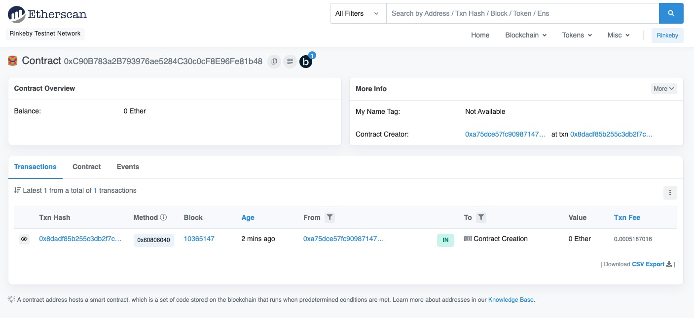

### W4-2作业：
本次作业说明：
- w4-2为本次作业提交内容
- 合约代码在hardhat_demo目录
- pic目录为截图目录

### 作业要求：
* 在上一次作业的基础上：
  * 完成代币兑换后，直接质押 MasterChef
  * withdraw():从 MasterChef 提取 Token 方法

### 作业内容
### Q1：发⾏⼀个SushiToken：

### 步骤1：部署SushiToken合约
- [SushiToken合约地址](https://rinkeby.etherscan.io/address/0xC90B783a2B793976ae5284C30c0cF8E96Fe81b48)
  
- WETH合约源码,见hardhat_demo/contracts/Mysushi/SushiToken.sol

### 步骤2：部署MasterChef合约
- [master_chf合约地址](https://rinkeby.etherscan.io/address/0x14Ba8743D552883ea8E153cb49A5AE69B567DFEE)
- MasterChef合约源码,见hardhat_demo/contracts/Mysushi/MasterChef.sol

### 步骤3：添加LP
- [添加LP](https://rinkeby.etherscan.io/tx/0x393086986cc1324c39f1210999c88eacf47d3bbb76dc532970bf1ae7d1cf03fa)

### 步骤4：部署MyTokenSushiMarket
- [MyTokenSushiMarket合约地址](https://rinkeby.etherscan.io/address/0x87754711d73d851E3d16437072BB883Ff63b4014)
- [部署MyTokenSushiMarket](https://rinkeby.etherscan.io/tx/0x85e0fbb2f071bee5bd0cc57478dd1fed1da31e012ce7f2b4d16ee6dad7eb9a8b)

### 步骤5：部署buy_token
- [buy_token](https://rinkeby.etherscan.io/tx/0x8e349b49ef93169f1197c5d2e86162045b532389a477c5f84a2e9ef9a3f90a29)

